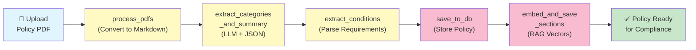
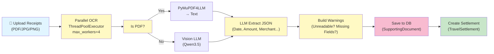
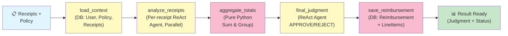
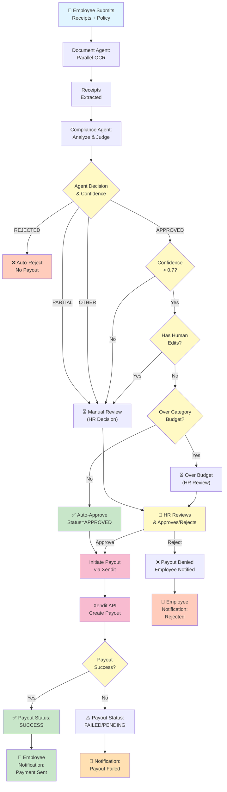

# Reclaim Workflows - Mermaid Diagrams

## 1. Policy Agent Workflow
*LangGraph 5-node pipeline for HR policy extraction and indexing*

---

## 2. Document Agent Workflow
*Parallel ThreadPool for receipt OCR (max 4 workers)*

---

## 3. Compliance Agent Workflow
*LangGraph 5-node pipeline for receipt analysis and judgment*

---

## 4. Main Big Workflow: OCR Receipt → Autonomous Payout via Xendit
*End-to-end flow with all decision branches*

---

## Summary Table

| Workflow | Type | Purpose | Key Decision |
|----------|------|---------|--------------|
| **Policy Agent** | LangGraph | Extract & index reimbursement policies | Categories + Conditions → RAG Index |
| **Document Agent** | Parallel OCR | Extract receipt details from images/PDFs | LLM → JSON Extraction |
| **Compliance Agent** | LangGraph | Analyze receipts against policy | APPROVED / REJECTED / MANUAL_REVIEW |
| **Main Flow** | End-to-End | OCR → Judgment → Auto-Payout | Confidence + Budget + Edits → Decision |

---

## Key Decision Points (Main Workflow)

1. **Agent Judgment**: APPROVED, REJECTED, PARTIAL, or OTHER
2. **Confidence Threshold**: > 0.7 required for auto-approval
3. **Human Edits**: Any edits → requires HR review
4. **Budget Check**: Claim > auto-approval budget → HR review
5. **Final Status**: APPROVED (auto-payout), REJECTED (no payout), REVIEW (HR action)
6. **Xendit Payout**: Only triggered after HR approval or auto-approval conditions met
