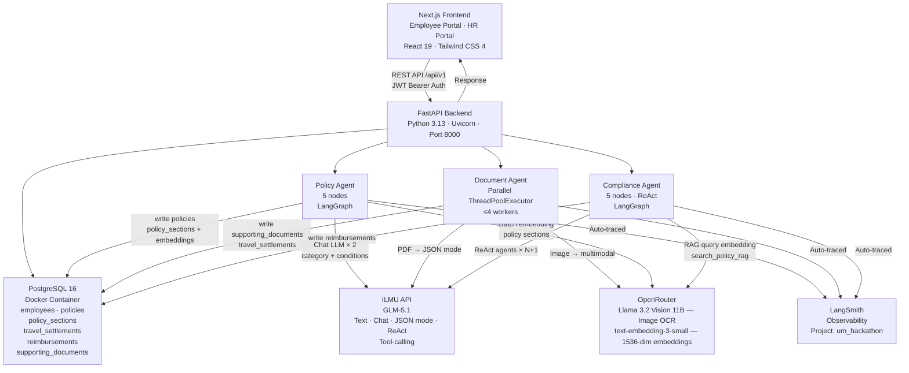
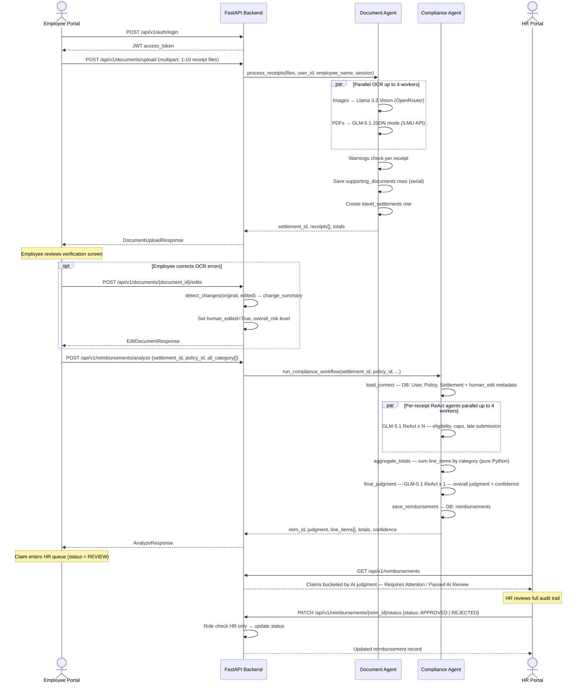
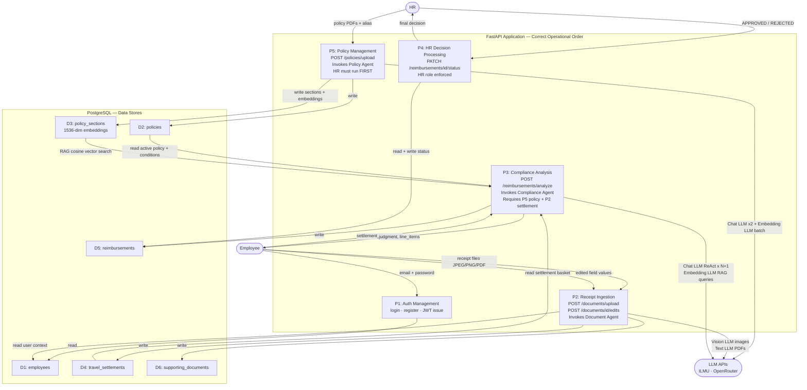
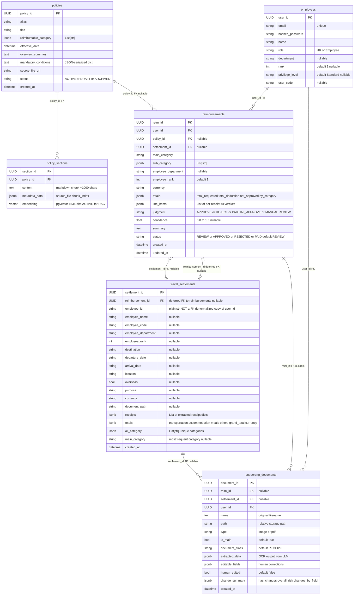

# SAD Mermaid Diagrams

All diagrams correspond to sections in `SAD_Report.md`. Each diagram is self-contained and can be rendered in any Mermaid-compatible viewer (GitHub, Notion, Obsidian, etc.).

---

## Diagram 1: System Dependency Map (Section 2.1.3)

---

## Diagram 2: Context Window Flow per LLM Call (Section 2.1.3)

---

## Diagram 3: Sequence Diagram — End-to-End Claim Submission Flow (Section 2.1.4)

---

## Diagram 4: Data Flow Diagram — Level 1 (Section 2.3.1.1)

---

## Diagram 5: Entity Relationship Diagram — Normalized Database Schema (Section 2.3.2)

> **Note on `travel_settlements.employee_id`**: This is a plain `str` column — it stores a copy of the user's UUID as a string for PDF template rendering, but carries **no FK constraint** in the database. The formal relationship between employees and their travel settlements is tracked via `reimbursements.user_id → employees.user_id`.

---

## Diagram 6: AI Agent Workflow — LangGraph Node Pipelines (Reference)

```mermaid
flowchart TD
    subgraph W1["Workflow 1 — Policy Agent (HR uploads policy PDF)"]
        direction LR
        A1["process_pdfs\nPyMuPDF4LLM → markdown"]
        A2["extract_categories_and_summary\nGLM-5.1\ntitle, categories[]"]
        A3["extract_conditions\nGLM-5.1\nmandatory_conditions"]
        A4["save_to_db\npolicies row"]
        A5["embed_and_save_sections\ntext-embed-3-small\npolicy_sections rows\n1536-dim vectors"]
        A1 --> A2 --> A3 --> A4 --> A5
    end

    subgraph W2["Workflow 2 — Document Agent (Employee uploads receipts)"]
        direction LR
        B1["Get Active Categories\nfrom DB"]
        B2["Parallel OCR\nThreadPoolExecutor ≤4 workers"]
        B3["Image → Llama 3.2 Vision\nOpenRouter"]
        B4["PDF → GLM-5.1\nJSON mode"]
        B5["Warnings Check"]
        B6["Save supporting_documents\nserial"]
        B7["Create travel_settlements"]
        B1 --> B2
        B2 --> B3
        B2 --> B4
        B3 --> B5
        B4 --> B5
        B5 --> B6
        B6 --> B7
    end

    subgraph W3["Workflow 3 — Compliance Agent (Employee submits for analysis)"]
        direction LR
        C1["load_context\nDB: User, Policy\nSettlement + human_edit"]
        C2["analyze_receipts\nParallel ReAct ≤4 workers\nGLM-5.1 x N\nmax 5 tool calls each"]
        C3["aggregate_totals\nPure Python\nsum line_items by category"]
        C4["final_judgment\nReAct x 1\nGLM-5.1\nmax 3 tool calls"]
        C5["save_reimbursement\nreimbursements row"]
        C1 --> C2 --> C3 --> C4 --> C5
    end
```

