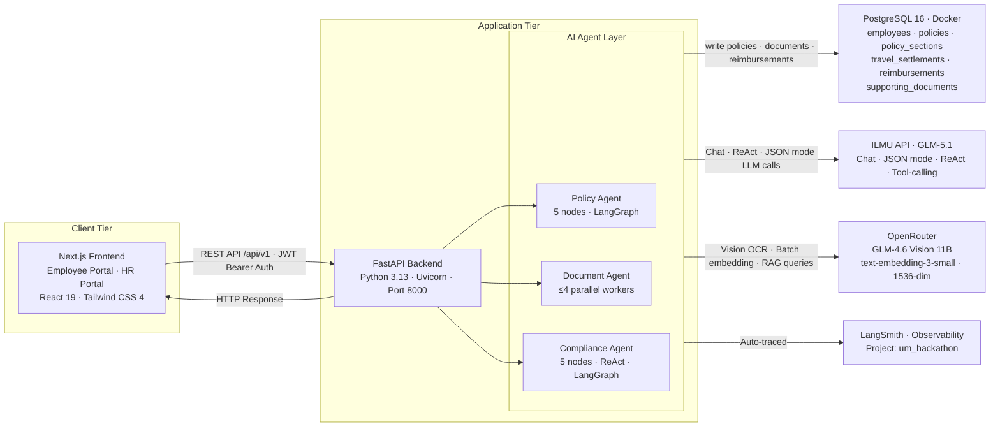
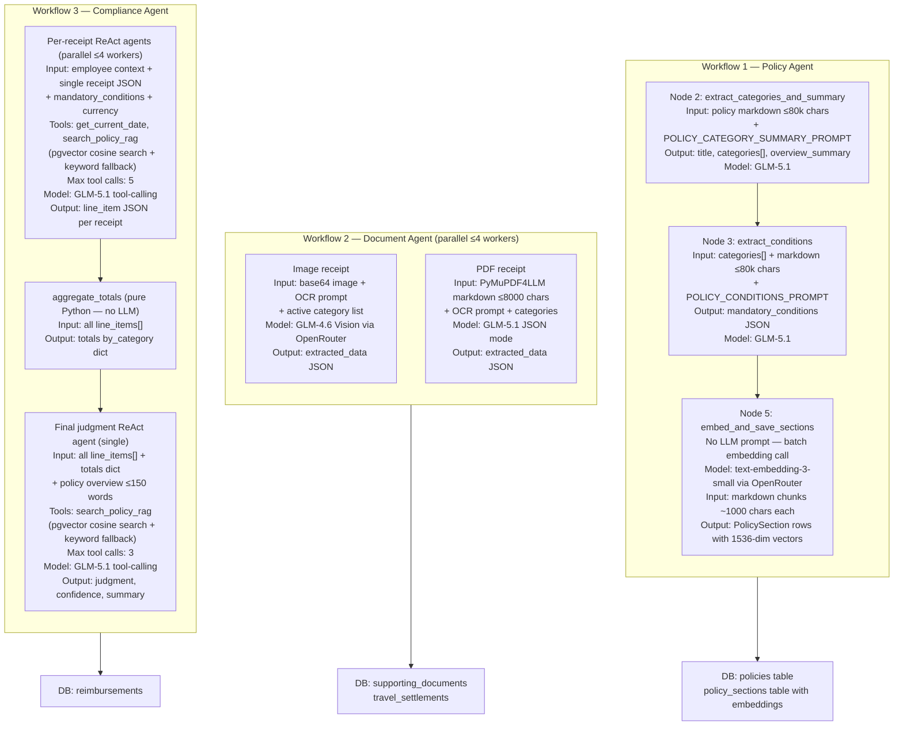
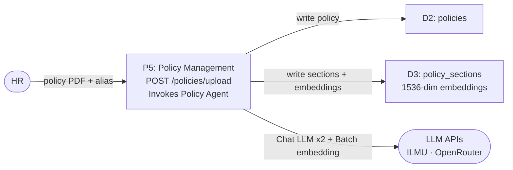
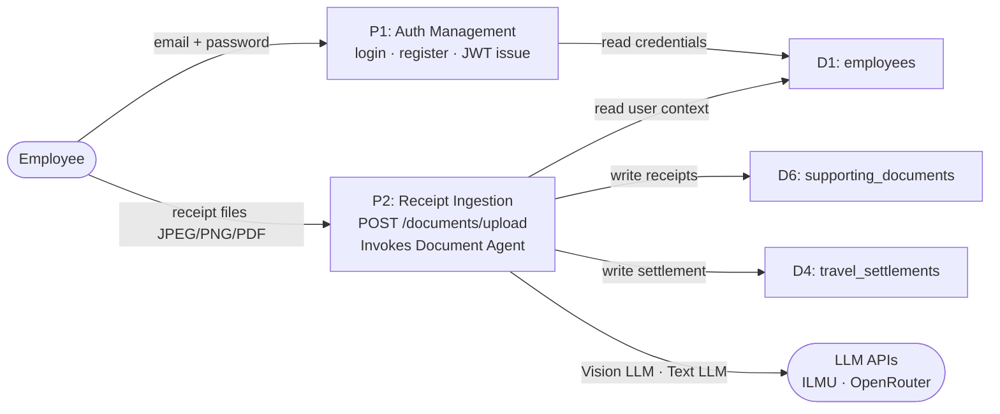
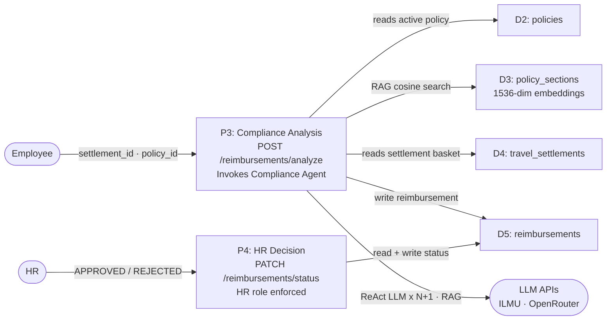

# SAD Mermaid Diagrams

All diagrams correspond to sections in `SAD_Report.md`. Each diagram is self-contained and can be rendered in any Mermaid-compatible viewer (GitHub, Notion, Obsidian, etc.).

---

## Diagram 1: System Dependency Map (Section 2.1.3)

---

## Diagram 2: Context Window Flow per LLM Call (Section 2.1.3)

---

## Diagram 3: Sequence Diagram — End-to-End Claim Submission Flow (Section 2.1.4)

---

## Diagram 4a: DFD — HR Policy Setup (Section 2.3.1.1)

---

## Diagram 4b: DFD — Employee Auth & Receipt Submission (Section 2.3.1.1)

---

## Diagram 4c: DFD — Compliance Analysis & HR Decision (Section 2.3.1.1)

---

## Diagram 5: Entity Relationship Diagram — Normalized Database Schema (Section 2.3.2)

```mermaid
%%{init: {'er': {'layoutDirection': 'LR'}}}%%
erDiagram
    departments {
        UUID        department_id           PK
        string      name                    ""
        string      cost_center_code        "nullable"
    }

    employees {
        UUID        user_id                 PK
        UUID        department_id           FK "nullable"
        string      user_code               "nullable"
        string      email                   "unique"
        string      hashed_password         ""
        string      name                    ""
        string      role                    "UserRole"
        string      privilege_level         "PrivilegeLevel"
        int         rank                    "default 1"
        bool        is_active               "default true"
        datetime    created_at              "nullable"
    }

    policies {
        UUID        policy_id               PK
        UUID        created_by              FK
        string      alias                   ""
        string      title                   ""
        datetime    effective_date          ""
        datetime    expiry_date             "nullable"
        text        overview_summary        ""
        text        mandatory_conditions    ""
        string      source_file_url         ""
        jsonb       reimbursable_categories "List[str]"
        string      status                  "PolicyStatus"
        datetime    created_at              ""
    }

    policy_sections {
        UUID        section_id              PK
        UUID        policy_id               FK
        text        content                 "markdown chunk"
        jsonb       metadata_data           ""
        vector      embedding               "1536-dim"
    }

    travel_settlements {
        UUID        settlement_id           PK
        UUID        user_id                 FK
        string      document_path           "nullable"
        string      main_category           "nullable"
        string      destination             "nullable"
        date        departure_date          "nullable"
        date        arrival_date            "nullable"
        string      location                "nullable"
        bool        overseas                "nullable"
        string      purpose                 "nullable"
        string      currency                "nullable"
        Decimal     total_claimed_amount    "nullable"
        Decimal     total_approved_amount   "nullable"
        Decimal     total_rejected_amount   "nullable"
        jsonb       categories              "List[str]"
        datetime    created_at              ""
    }

    settlement_receipts {
        UUID        receipt_id              PK
        UUID        settlement_id           FK
        UUID        document_id             FK "nullable"
        string      merchant_name           "nullable"
        date        receipt_date            "nullable"
        string      category                "nullable"
        Decimal     claimed_amount          "nullable"
        string      currency                "nullable"
    }

    reimbursements {
        UUID        reim_id                 PK
        UUID        user_id                 FK
        UUID        policy_id               FK "nullable"
        UUID        settlement_id           FK "nullable"
        UUID        reviewed_by             FK "nullable"
        string      main_category           ""
        jsonb       sub_categories          "List[str]"
        string      currency                ""
        Decimal     total_claimed_amount    ""
        Decimal     total_approved_amount   "nullable"
        Decimal     total_rejected_amount   "nullable"
        string      judgment                "JudgmentResult"
        float       confidence              "nullable"
        jsonb       ai_reasoning            ""
        string      summary                 ""
        string      status                  "ReimbursementStatus"
        datetime    reviewed_at             "nullable"
        datetime    created_at              ""
        datetime    updated_at              ""
    }

    line_items {
        UUID        line_item_id            PK
        UUID        reim_id                 FK
        UUID        document_id             FK "nullable"
        UUID        policy_section_ref      FK "nullable"
        string      description             ""
        string      category                ""
        float       quantity                "default 1.0"
        Decimal     unit_price              "nullable"
        Decimal     claimed_amount          ""
        Decimal     approved_amount         "nullable"
        string      currency                ""
        date        expense_date            "nullable"
        string      judgment                "nullable"
        string      rejection_reason        "nullable"
    }

    supporting_documents {
        UUID        document_id             PK
        UUID        reim_id                 FK "nullable"
        UUID        settlement_id           FK "nullable"
        UUID        user_id                 FK
        string      name                    "original filename"
        string      path                    "relative path"
        string      type                    "image or pdf"
        bool        is_main                 "default true"
        string      document_class          "default RECEIPT"
        jsonb       extracted_data          "OCR output"
        jsonb       editable_fields         "human corrections"
        bool        human_edited            "default false"
        jsonb       change_summary          "has_changes"
        datetime    created_at              "nullable"
    }

    document_change_logs {
        UUID        log_id                  PK
        UUID        document_id             FK
        UUID        changed_by              FK
        string      field_name              ""
        string      old_value               "nullable"
        string      new_value               "nullable"
        datetime    changed_at              ""
    }

    reimbursements }o--|| policies : "governed_by"
    reimbursements |o--|| travel_settlements : "generated_from"
    reimbursements ||--o{ line_items : "contains"
    
    policies }o--|| employees : "created_by"
    policies ||--o{ policy_sections : "contains"
    
    travel_settlements }o--|| employees : "submitted_by"
    travel_settlements ||--o{ settlement_receipts : "contains"
    
    line_items }o--|| policy_sections : "violates_section"
    
    settlement_receipts }o--|| supporting_documents : "references_doc"
    line_items }o--|| supporting_documents : "references_doc"
    
    supporting_documents ||--o{ document_change_logs : "tracks"
    
    employees }o--|| departments : "belongs_to"
```

---

## Diagram 6: AI Agent Workflow — LangGraph Node Pipelines (Reference)

```mermaid
flowchart TD
    subgraph W1["Workflow 1 — Policy Agent (HR uploads policy PDF)"]
        direction LR
        A1["process_pdfs\nPyMuPDF4LLM → markdown"]
        A2["extract_categories_and_summary\nGLM-5.1\ntitle, categories[]"]
        A3["extract_conditions\nGLM-5.1\nmandatory_conditions"]
        A4["save_to_db\npolicies row"]
        A5["embed_and_save_sections\ntext-embed-3-small\npolicy_sections rows\n1536-dim vectors"]
        A1 --> A2 --> A3 --> A4 --> A5
    end

    subgraph W2["Workflow 2 — Document Agent (Employee uploads receipts)"]
        direction LR
        B1["Get Active Categories\nfrom DB"]
        B2["Parallel OCR\nThreadPoolExecutor ≤4 workers"]
        B3["Image → GLM-4.6 Vision\nOpenRouter"]
        B4["PDF → GLM-5.1\nJSON mode"]
        B5["Warnings Check"]
        B6["Save supporting_documents\nserial"]
        B7["Create travel_settlements"]
        B1 --> B2
        B2 --> B3
        B2 --> B4
        B3 --> B5
        B4 --> B5
        B5 --> B6
        B6 --> B7
    end

    subgraph W3["Workflow 3 — Compliance Agent (Employee submits for analysis)"]
        direction LR
        C1["load_context\nDB: User, Policy\nSettlement + human_edit"]
        C2["analyze_receipts\nParallel ReAct ≤4 workers\nGLM-5.1 x N\nmax 5 tool calls each"]
        C3["aggregate_totals\nPure Python\nsum line_items by category"]
        C4["final_judgment\nReAct x 1\nGLM-5.1\nmax 3 tool calls"]
        C5["save_reimbursement\nreimbursements row"]
        C1 --> C2 --> C3 --> C4 --> C5
    end
```

